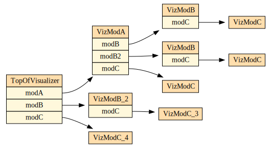

Chisel / FIRRTL Diagramming Project
=======================

This project can generate GraphViz dot files and from those png files representing Chisel generated Firrtl circuits.
It is also an example of a creating a Firrtl Transformation.  This transformation can be applied through the 
use of annotations as demonstrated in the examples.GCD test.  

## Example

### Top Level Example


### Module Example


## Using
### Install
Installing this software should be pretty much the following.
```bash
git clone https://github.com/chick/visualizer
cd visualizer
```

### Dependencies
This project requires [GraphViz](https://www.graphviz.org/), specifically a default path to the program `dot`.

### Creating Circuit Diagrams.
To create a set of graphs of a Firrtl Circuit all you need is this project and a Firrtl file (typically a file 
generated by Chisel with a `.fir` extension). Let's say you have a Firrtl file `~/projects/output/circuit.fir`.
From the command line you while in this directory for this project, you run
```bash
./diagram -i ~/projects/output/circuit.fir
```
This will created a number of files in the same directory as the firrtl file that representing the firrtl graph.
Each file will be a diagram for each module
contained in the firrtl file, plus a file TopLevel.dot.svg file. It will also attempt to open the TopLevel.dot.svg file
in a browser using the command `open`. 
Each Module in the TopLevel diagram is clickable and should take you into the diagram for that specific module.
Because of the size of these files, the diagrams will include the internal logic of that module plus and IO only
presentation of any sub-modules found.

## Options
* -t, --targer-dir sets the output directory for the svg
* -s, --start-module sets the module name where the graphs will start being generated. The default is at the top

## How Visualizer Works
This program uses a number of firrtl transforms to create multiple graphviz dot file graph programs.
The dot files are translated into .svg files. See [GeneratorBootcamp Firrtl Chapters](https://github.com/freechipsproject/chisel-bootcamp)
for a good introduction to writing Firrtl transforms

## TODO
- This used to work by annotating a circuit, consider re-adding that
- Setting to allow the graphs to go deeper into sub-module logic
- Big firrtl modules that take more than 7 seconds to render are stopped, try and fix this. 

